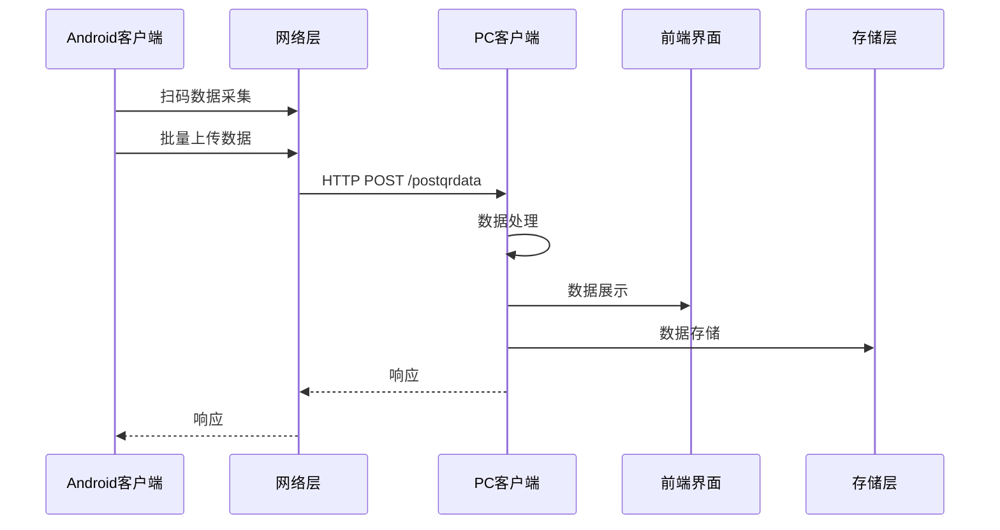

# CatScan 系统架构设计

## 1. 系统概述

CatScan 是一个跨平台的扫码数据采集和管理系统，由 Android 客户端和 PC 客户端组成。Android 客户端负责扫码数据的采集和管理，PC 客户端负责数据的接收、展示和处理。

## 2. 系统架构

### 2.1 整体架构



### 2.2 模块划分

#### Android 客户端

| 模块 | 职责 | 实现文件 |
|------|------|----------|
| 扫码模块 | 扫码数据采集 | `MainViewModel.kt` |
| 模板管理 | 模板数据管理 | `MainViewModel.kt` |
| 数据存储 | 本地数据存储 | `ScanHistoryManager.kt` |
| 网络通讯 | 与PC客户端通讯 | `ScanRepository.kt`, `CatScanClient.kt` |
| 服务发现 | 发现PC客户端 | `NetworkDiscovery.kt` |

#### PC 客户端

| 模块 | 职责 | 实现文件 |
|------|------|----------|
| 数据接收 | 接收Android客户端数据 | `main.py` |
| 数据处理 | 处理接收到的数据 | `main.py` |
| 前端界面 | 展示数据和操作界面 | `web/index.html` |
| 服务发现 | 响应Android客户端发现请求 | `udp_discovery.py` |
| 键盘输入 | 模拟键盘输入 | `main.py` |

## 3. 网络通讯设计

### 3.1 通讯协议

- **传输协议**：HTTP/1.1
- **服务端口**：29027（数据传输），29028（服务发现）
- **数据格式**：JSON
- **编码**：UTF-8

### 3.2 API 设计

#### POST /postqrdata

**功能**：接收Android客户端发送的数据

**请求体**：

1. 单条数据格式：

```json
{
  "qrdata": "扫码内容",
  "templateName": "模板名称",
  "operator": "操作人",
  "campus": "校区",
  "building": "楼栋",
  "floor": "楼层",
  "room": "房间",
  "id": "唯一标识符",
  "action": "操作类型（add/update/delete）"
}
```

2. 批量数据格式：

```json
{
  "batch": true,
  "data": [
    {
      "qrdata": "扫码内容1",
      "templateName": "模板名称",
      "operator": "操作人",
      "campus": "校区",
      "building": "楼栋",
      "floor": "楼层",
      "room": "房间",
      "id": "唯一标识符",
      "action": "操作类型（add/update/delete）"
    },
    {
      "qrdata": "扫码内容2",
      "templateName": "模板名称",
      "operator": "操作人",
      "campus": "校区",
      "building": "楼栋",
      "floor": "楼层",
      "room": "房间",
      "id": "唯一标识符",
      "action": "操作类型（add/update/delete）"
    }
  ]
}
```

**响应**：

```json
{
  "status": "received",
  "code": 200,
  "timestamp": "2026-01-31 12:00",
  "msg": "成功处理 2 条数据"
}
```

### 3.3 服务发现

- **协议**：UDP
- **端口**：29028
- **实现**：PC客户端在启动时启动UDP服务，监听29028端口，Android客户端发送广播数据包发现PC客户端

## 4. 数据传递协议

### 4.1 数据结构

#### TemplateScan

| 字段 | 类型 | 说明 |
|------|------|------|
| id | String | 唯一标识符（UUID） |
| text | String | 扫码内容 |
| timestamp | Long | 扫码时间戳 |
| operator | String | 操作人 |
| campus | String | 校区 |
| building | String | 楼栋 |
| floor | String | 楼层 |
| room | String | 房间 |

#### TemplateModel

| 字段 | 类型 | 说明 |
|------|------|------|
| id | String | 唯一标识符（UUID） |
| name | String | 模板名称 |
| operator | String | 操作人 |
| campus | String | 校区 |
| building | String | 楼栋 |
| maxFloor | Int | 最大楼层 |
| roomCountPerFloor | Int | 每层房间数 |
| selectedRooms | List<String> | 选中的房间 |
| scans | List<TemplateScan> | 扫码数据 |

#### ScanItem

| 字段 | 类型 | 说明 |
|------|------|------|
| id | Long | 唯一标识符 |
| text | String | 扫码内容 |
| timestamp | Long | 扫码时间戳 |
| operator | String | 操作人 |
| templateId | String | 模板ID |
| area | Area | 区域信息 |
| uploaded | Boolean | 是否已上传 |

### 4.2 操作类型

| 操作类型 | 说明 |
|----------|------|
| add | 添加数据 |
| update | 更新数据 |
| delete | 删除数据 |

## 5. 性能优化

### 5.1 批量上传

- Android客户端采用批量上传策略，减少网络请求次数
- 每次上传最多100条数据
- 上传间隔500ms，避免请求过于频繁

### 5.2 数据压缩

- 对于大量数据，采用JSON压缩传输
- 减少数据传输量，提高传输速度

### 5.3 缓存策略

- Android客户端采用本地缓存，避免重复上传
- PC客户端采用内存缓存，提高数据处理速度

## 6. 可靠性设计

### 6.1 错误处理

- 网络请求失败时，Android客户端会重试3次
- 数据格式错误时，PC客户端会返回错误信息
- 服务端异常时，会返回详细的错误信息

### 6.2 数据一致性

- 每条数据都有唯一标识符，确保数据一致性
- 支持数据更新和删除操作，保持两端数据一致

### 6.3 服务发现

- Android客户端定期发送服务发现请求
- PC客户端响应服务发现请求，提供服务地址

## 7. 安全性设计

### 7.1 数据传输

- 采用HTTPS加密传输（可选）
- 数据传输过程中加密敏感信息

### 7.2 访问控制

- 支持IP白名单，限制访问来源
- 支持API密钥认证（可选）

## 8. 扩展性设计

### 8.1 协议扩展

- 采用JSON格式，易于扩展字段
- 支持版本控制，确保兼容性

### 8.2 功能扩展

- 模块化设计，易于添加新功能
- 支持插件机制，扩展系统功能

## 9. 部署与集成

### 9.1 Android 客户端

- 支持Android 7.0+系统
- 权限要求：相机、存储

### 9.2 PC 客户端

- 支持Windows 10+系统
- 依赖：Python 3.8+, FastAPI, Eel

## 10. 监控与日志

### 10.1 日志系统

- Android客户端：日志存储在本地文件
- PC客户端：日志存储在`log`目录

### 10.2 监控指标

- 网络请求成功率
- 数据传输延迟
- 系统资源使用情况

## 11. 总结

CatScan 系统采用分层架构设计，通过 HTTP 协议实现 Android 客户端和 PC 客户端之间的通讯，支持批量数据传输和操作类型标识，确保数据的一致性和可靠性。系统具有良好的扩展性和可维护性，可以根据需求进行功能扩展和性能优化。