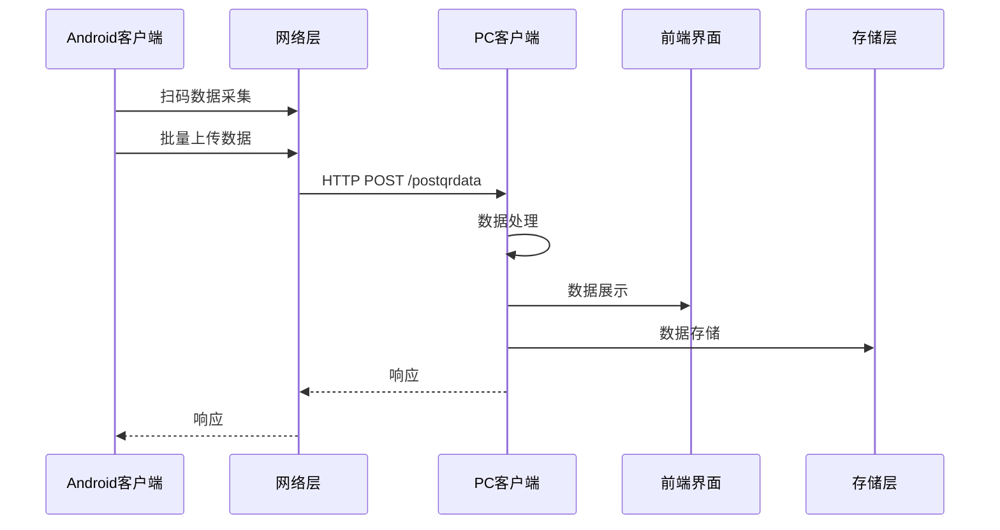

# CatScan - 二维码/条码扫描工具

一款功能强大的跨平台二维码和条码扫描系统，由Android客户端和Windows PC客户端组成，支持实时数据采集、模板管理、PC联动和自动输入等功能。

## 📋 系统概述

CatScan是一个完整的扫码数据采集和管理解决方案，通过以下流程实现数据的采集和处理：

1. **数据采集**：Android客户端通过相机扫描二维码/条码
2. **数据管理**：支持模板管理，按楼层/房间自动轮询
3. **数据同步**：通过网络将扫码数据实时同步到PC客户端
4. **数据处理**：PC客户端接收、展示和处理扫码数据
5. **自动输入**：PC客户端可自动将扫码内容输入到当前焦点应用

## 🔄 系统架构

### 整体架构



### 模块划分

#### Android 客户端

| 模块 | 职责 | 实现文件 |
|------|------|----------|
| 扫码模块 | 扫码数据采集 | `MainViewModel.kt` |
| 模板管理 | 模板数据管理 | `MainViewModel.kt` |
| 数据存储 | 本地数据存储 | `ScanHistoryManager.kt` |
| 网络通讯 | 与PC客户端通讯 | `ScanRepository.kt`, `CatScanClient.kt` |
| 服务发现 | 发现PC客户端 | `NetworkDiscovery.kt` |

#### PC 客户端

| 模块 | 职责 | 实现文件 |
|------|------|----------|
| 数据接收 | 接收Android客户端数据 | `main.py` |
| 数据处理 | 处理接收到的数据 | `main.py` |
| 前端界面 | 展示数据和操作界面 | `web/index.html` |
| 服务发现 | 响应Android客户端发现请求 | `udp_discovery.py` |
| 键盘输入 | 模拟键盘输入 | `main.py` |

## 📱 功能特性

### Android客户端
- ✅ **实时扫码**：支持二维码、一维码（CODE128、CODE39、EAN-13、EAN-8）识别
- ✅ **自动复制**：扫码后自动将内容复制到剪贴板
- ✅ **模板管理**：支持多模板配置，按楼层/房间自动轮询
- ✅ **数据持久化**：扫码历史本地存储，支持导出
- ✅ **PC联动**：自动发现局域网内的Windows客户端，推送扫码数据
- ✅ **自动输入**：PC端可自动将扫码内容输入到当前焦点应用
- ✅ **数据同步**：删除、保存操作自动同步到PC客户端
- ✅ **响应式UI**：现代化Jetpack Compose界面，支持自适应布局
- ✅ **无抖动体验**：优化的状态管理，避免界面抖动

### Windows客户端
- ✅ **数据接收**：接收Android端推送的扫码数据
- ✅ **数据管理**：查看、删除、导出扫码历史（CSV格式）
- ✅ **自动输入**：自动将扫码内容输入到当前焦点窗口
- ✅ **网络发现**：UDP广播自动发现，无需手动配置IP
- ✅ **现代化UI**：响应式界面，支持全屏和自适应
- ✅ **操作同步**：接收并处理Android端的删除、保存操作
- ✅ **批量处理**：支持批量数据上传和处理
- ✅ **实时反馈**：操作结果即时显示，提升用户体验

## 📁 项目结构

```
CatScan/
├── app/                          # Android客户端
│   ├── src/main/java/
│   │   └── com/example/catscandemo/
│   │       ├── data/            # 数据层
│   │       │   ├── network/     # 网络通信
│   │       │   └── repository/ # 数据仓库
│   │       ├── domain/          # 领域层
│   │       │   ├── model/       # 数据模型
│   │       │   └── use_case/    # 业务逻辑
│   │       ├── presentation/    # 表示层
│   │       │   └── viewmodel/   # ViewModel
│   │       ├── ui/              # UI层
│   │       │   ├── components/   # UI组件
│   │       │   └── main/        # 主界面
│   │       └── utils/          # 工具类
│   └── build.gradle.kts
│
├── winClient/                    # Windows客户端
│   ├── main.py                   # 主程序入口
│   ├── udp_discovery.py          # UDP网络发现服务
│   ├── requirements.txt          # Python依赖
│   └── web/                      # Web界面
│       ├── index.html
│       ├── css/
│       └── js/
└── ARCHITECTURE.md               # 架构设计文档
```

## 🛠️ 技术栈

### Android客户端
- **语言**：Kotlin
- **UI框架**：Jetpack Compose + Material3
- **架构模式**：MVVM (Model-View-ViewModel)
- **相机**：CameraX
- **条码识别**：ML Kit Barcode Scanning
- **网络**：OkHttp3
- **数据存储**：JSON文件（本地存储）
- **协程**：Kotlin Coroutines
- **依赖注入**：Hilt

### Windows客户端
- **语言**：Python 3.8+
- **Web框架**：Eel (Electron-like)
- **后端API**：FastAPI + Uvicorn
- **网络发现**：UDP广播
- **键盘输入**：pynput
- **前端**：Vue.js 3 + Element Plus
- **打包工具**：PyInstaller

## 📡 通信协议

### HTTP API
- **端口**：29027
- **端点**：`POST /postqrdata`
- **数据格式**：JSON

#### 单条数据格式
```json
{
  "qrdata": "扫码内容",
  "templateName": "模板名称",
  "operator": "操作员",
  "campus": "校区",
  "building": "楼栋",
  "floor": "楼层",
  "room": "房间",
  "id": "唯一标识符",
  "action": "操作类型（add/update/delete）"
}
```

#### 批量数据格式
```json
{
  "batch": true,
  "data": [
    {
      "qrdata": "扫码内容1",
      "templateName": "模板名称",
      "operator": "操作员",
      "campus": "校区",
      "building": "楼栋",
      "floor": "楼层",
      "room": "房间",
      "id": "唯一标识符",
      "action": "操作类型"
    },
    {
      "qrdata": "扫码内容2",
      "templateName": "模板名称",
      "operator": "操作员",
      "campus": "校区",
      "building": "楼栋",
      "floor": "楼层",
      "room": "房间",
      "id": "唯一标识符",
      "action": "操作类型"
    }
  ]
}
```

### UDP发现协议
- **端口**：29028
- **请求消息**：`CATSCAN_DISCOVERY_REQUEST`
- **响应消息**：`CATSCAN_DISCOVERY_RESPONSE:http://IP:29027/postqrdata`

### 操作类型

| 操作类型 | 说明 |
|----------|------|
| add | 添加数据 |
| update | 更新数据 |
| delete | 删除数据 |

## 📊 数据结构

### TemplateScan

| 字段 | 类型 | 说明 |
|------|------|------|
| id | String | 唯一标识符（UUID） |
| text | String | 扫码内容 |
| timestamp | Long | 扫码时间戳 |
| operator | String | 操作人 |
| campus | String | 校区 |
| building | String | 楼栋 |
| floor | String | 楼层 |
| room | String | 房间 |

### TemplateModel

| 字段 | 类型 | 说明 |
|------|------|------|
| id | String | 唯一标识符（UUID） |
| name | String | 模板名称 |
| operator | String | 操作人 |
| campus | String | 校区 |
| building | String | 楼栋 |
| maxFloor | Int | 最大楼层 |
| roomCountPerFloor | Int | 每层房间数 |
| selectedRooms | List<String> | 选中的房间 |
| scans | List<TemplateScan> | 扫码数据 |

### ScanResult

| 字段 | 类型 | 说明 |
|------|------|------|
| id | Long | 唯一标识符 |
| index | Int | 索引 |
| scanData | ScanData | 扫码数据 |
| uploaded | Boolean | 是否已上传 |

## ⚡ 性能优化

### 批量上传
- Android客户端采用批量上传策略，减少网络请求次数
- 每次上传最多100条数据
- 上传间隔500ms，避免请求过于频繁

### 数据压缩
- 对于大量数据，采用JSON压缩传输
- 减少数据传输量，提高传输速度

### 缓存策略
- Android客户端采用本地缓存，避免重复上传
- PC客户端采用内存缓存，提高数据处理速度

### UI优化
- Android客户端使用Jetpack Compose，实现响应式UI
- 优化状态管理，避免界面抖动
- 使用协程处理异步操作，提高UI响应速度

## 🛡️ 可靠性设计

### 错误处理
- 网络请求失败时，Android客户端会重试3次
- 数据格式错误时，PC客户端会返回错误信息
- 服务端异常时，会返回详细的错误信息

### 数据一致性
- 每条数据都有唯一标识符，确保数据一致性
- 支持数据更新和删除操作，保持两端数据一致
- 批量上传时使用事务处理，确保数据完整性

### 服务发现
- Android客户端定期发送服务发现请求
- PC客户端响应服务发现请求，提供服务地址
- 支持手动输入PC的IP地址，确保连接可靠性

## 📈 扩展性设计

### 协议扩展
- 采用JSON格式，易于扩展字段
- 支持版本控制，确保兼容性

### 功能扩展
- 模块化设计，易于添加新功能
- 支持插件机制，扩展系统功能

### 平台扩展
- 设计为跨平台架构，易于扩展到其他平台
- 网络协议标准化，支持不同客户端实现

## 📝 开发指南

### 代码规范
- **Kotlin**：遵循Kotlin官方编码规范
- **Python**：遵循PEP 8规范
- **命名**：使用有意义的变量和函数名
- **注释**：关键逻辑添加注释说明

### 开发流程
1. **克隆项目**：`git clone <repository-url>`
2. **Android开发**：使用Android Studio打开app目录
3. **PC端开发**：在winClient目录运行`python main.py`
4. **测试**：测试扫码、数据同步和PC端接收
5. **打包**：使用提供的脚本打包为可执行文件

### 调试技巧
- **Android端**：使用Logcat查看日志
- **PC端**：查看log目录下的日志文件
- **网络调试**：使用Wireshark捕获网络数据包
- **服务发现**：使用UDP调试工具测试服务发现

## 🚀 快速开始

### Android客户端

#### 环境要求
- Android Studio Hedgehog | 2023.1.1 或更高版本
- JDK 11+
- Android SDK 35+
- Gradle 8.0+

#### 构建步骤
```bash
# 克隆项目
git clone <repository-url>
cd CatScan

# 使用Android Studio打开项目
# 或使用命令行构建
./gradlew assembleRelease

# APK位置
app/release/app-release.apk
```

#### 安装
1. 在Android设备上启用"未知来源"安装
2. 将APK传输到设备并安装
3. 授予相机和网络权限

### Windows客户端

#### 环境要求
- Python 3.8 或更高版本
- Windows 10/11

#### 安装步骤

1. **安装Python依赖**
```bash
cd winClient
pip install -r requirements.txt
```

2. **运行开发模式**
```bash
python main.py
```

3. **打包为EXE（可选）**
```bash
# 安装PyInstaller
pip install pyinstaller

# 打包
pyinstaller main.spec

# 或使用提供的脚本
build.cmd
```

#### 打包后的目录结构
```
dist/
├── main.exe          # 可执行文件
├── log/              # 日志目录
└── web/              # Web资源（已打包）
```

## 📖 使用说明

### Android端

1. **首次使用**
   - 打开应用，授予相机权限
   - 创建或选择模板
   - 配置模板信息（校区、楼栋、楼层、房间等）

2. **扫码操作**
   - 点击相机区域进行扫码
   - 扫码成功后自动复制到剪贴板
   - 历史记录自动保存

3. **连接PC端**
   - 确保手机和PC在同一局域网
   - 打开设置，点击"发现PC"
   - 选择发现的PC客户端
   - 开启"上传到PC"开关

4. **模板管理**
   - 创建多个模板用于不同场景
   - 配置楼层和房间号
   - 扫码时自动按模板轮询房间

5. **数据同步**
   - 删除、保存操作会自动同步到PC客户端
   - 确保两端数据保持一致

### Windows端

1. **启动程序**
   - 运行 `main.exe` 或 `python main.py`
   - 程序会自动启动Web界面和API服务

2. **查看数据**
   - 扫码数据自动显示在左侧表格
   - 点击行可复制数据
   - 点击删除按钮（✕）删除单条数据

3. **导出数据**
   - 点击"导出 CSV 数据"按钮
   - 文件保存为 `catscan_YYYY-MM-DD.csv`

4. **自动输入功能**
   - 开启"自动输入"开关
   - 扫码数据会自动输入到当前焦点窗口
   - 适用于任何支持文本输入的应用

5. **网络配置**
   - 程序自动显示本机IP地址
   - 点击IP地址可复制
   - 生成二维码供Android端扫描连接

6. **操作同步**
   - 接收并处理Android端的删除、保存操作
   - 保持两端数据一致

## 🔧 配置说明

### Android端配置

#### 模板配置
- **模板名称**：用于区分不同场景
- **操作员**：默认操作员名称
- **校区/楼栋**：位置信息
- **楼层数**：设置最大楼层
- **房间号**：选择要使用的房间号列表

#### 网络配置
- **服务器地址**：手动输入或自动发现
- **上传开关**：控制是否自动上传到PC
- **剪贴板开关**：控制是否自动复制到剪贴板
- **重复扫描开关**：控制是否允许重复扫描

### Windows端配置

#### 端口配置
- **API端口**：29027（可在代码中修改）
- **UDP发现端口**：29028（可在代码中修改）

#### 日志配置
- 日志文件位置：`log/qrdata_YYYY-MM-DD.log`
- FastAPI日志：`log/fastapi.log`

## 🐛 故障排除

### Android端

**问题：无法扫码**
- 检查相机权限是否已授予
- 确保光线充足
- 尝试重启应用

**问题：无法连接PC**
- 确保手机和PC在同一WiFi网络
- 检查Windows防火墙是否允许端口29027和29028
- 尝试手动输入PC的IP地址

**问题：上传失败**
- 检查网络连接
- 确认PC端程序正在运行
- 查看日志文件排查错误

**问题：界面抖动**
- 本应用已优化状态管理，避免界面抖动
- 如仍有问题，尝试重启应用

### Windows端

**问题：端口被占用**
- 关闭占用29027或29028端口的程序
- 或修改代码中的端口号

**问题：无法自动输入**
- 检查是否安装了pynput库
- 确保目标应用窗口处于焦点状态
- 某些安全软件可能阻止键盘模拟

**问题：窗口无法最大化**
- 安装pywin32库：`pip install pywin32`
- 或手动调整窗口大小

**问题：数据重复**
- PC客户端已实现数据去重逻辑
- 如仍有重复，尝试清空数据并重新同步

## 📝 开发说明

### 代码规范
- **Kotlin**：遵循Kotlin官方编码规范
- **Python**：遵循PEP 8规范
- **命名**：使用有意义的变量和函数名
- **注释**：关键逻辑添加注释说明

### 架构原则
- **单一职责**：每个类/函数只负责一个功能
- **依赖注入**：使用构造函数注入依赖
- **错误处理**：完善的异常处理和日志记录
- **资源管理**：及时释放资源，避免内存泄漏
- **响应式设计**：使用Jetpack Compose实现响应式UI

### 测试
- Android端：使用JUnit和Espresso进行单元测试和UI测试
- Windows端：手动测试各功能模块

## 📄 许可证

本项目采用 MIT 许可证。

## 🤝 贡献

欢迎提交Issue和Pull Request！

### 贡献流程
1. Fork本仓库
2. 创建特性分支 (`git checkout -b feature/amazing-feature`)
3. 提交更改 (`git commit -m 'Add some amazing feature'`)
4. 推送到分支 (`git push origin feature/amazing-feature`)
5. 打开Pull Request

## 📞 联系方式

如有问题或建议，请通过Issue反馈。

---

**版本**：2.0.3  
**更新日期**：2026-02-01  
**项目地址**：<repository-url>
